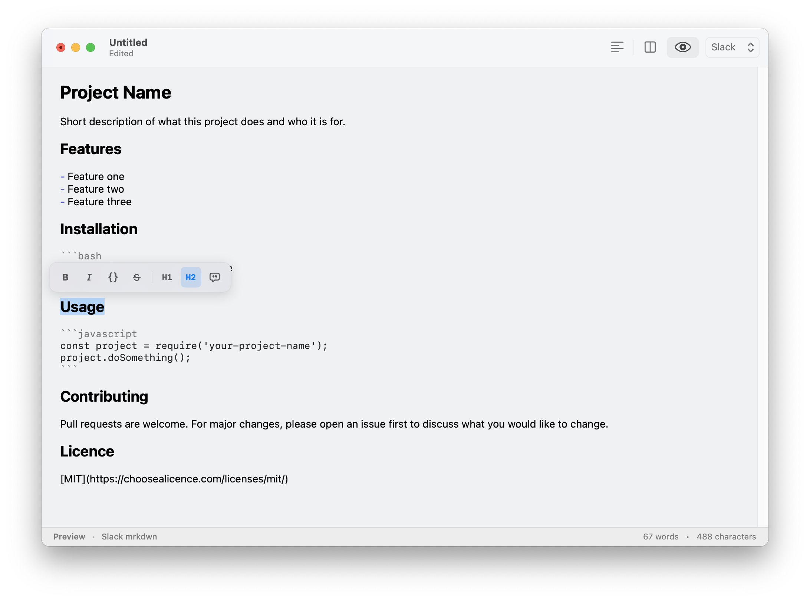

<div align="center">

#  Swash

### *A Native, High-Performance macOS Markdown Editor with Style*

[](https://swift.org)
[](https://apple.com)
[](./LICENSE)
[](#automated-distribution)

<p align="center">
  <b>Swash</b> is a sleek, distraction-free markdown editing workspace meticulously crafted with Swift, SwiftUI, and AppKit. Designed from the ground up for writers, developers, and note-takers who demand native macOS performance and an aesthetic writing experience.
</p>

---

[Key Features](#-key-features) • [Premium Design](#%EF%B8%8F-premium-design) • [Quick Start](#-quick-start) • [Automated Releases](#-automated-distribution) • [License](#-license)

</div>

---

## ✨ Key Features

Swash combines the raw speed of AppKit's native text engine with the rich, fluid layouts of SwiftUI.

*   **⚡ Blazing-Fast Native Engine** – Powered by an optimized `NSTextView` wrapper (`SwashTextView`) for instant rendering, smooth typing, and robust scroll performance.
*   **🫧 Floating Selection Bubble Menu** – Select text to trigger an elegant, contextual bubble overlay allowing you to style your prose instantly (Bold, Italic, Code, Links) without breaking your flow.
*   **📑 macOS Document-Based Architecture** – Full native integration with the macOS system. Benefit from automatic saving, file history, sandboxed security, and standard system menus.
*   **🎨 Premium Styled Markdown** – Implements a sophisticated, custom-crafted `MarkdownParser` to beautifully render markdown headings, lists, bold/italic, and inline code with refined spacing and professional typography.
*   **🛠️ Full macOS Integration** – Leverages system-level spellchecking, autocorrect options, undo/redo handling, and native keyboard navigation.

---

## 🖌️ Premium Design & Typographic Details

Every detail of Swash has been fine-tuned to create a calm, delightful, and highly-productive writing environment:

<p align="center">
  
</p>

### 📐 Ergonomic Elements
*   **Perfect Line Spacing & Padding**: Customized text container insets provide standard 20px padding margins to keep text perfectly centered and comfortable to read.
*   **System Color Adaptive**: Automatically respects Light & Dark mode settings, shifting colors with beautiful macOS vibrancy.
*   **Floating Component Synchronization**: The floating selection menu is synchronized dynamically with bounds modifications and viewport scroll offsets, staying exactly where you expect it.

---

## 🚀 Quick Start

### Prerequisites
*   A Mac running **macOS 15.0+**
*   **Xcode 16.0+** or Swift Command Line Tools

### Building from Source

To compile and launch the application locally:

```bash
# Clone the repository
git clone https://github.com/surrealroad/Swash.git
cd Swash

# Build the Release version
xcodebuild -scheme Swash -configuration Release -derivedDataPath build CODE_SIGN_IDENTITY="-"

# Run the app directly
open build/Build/Products/Release/Swash.app
```

---

## 🤖 Automated Distribution

Swash features a modern, automated release pipeline powered by GitHub Actions. Every push to the `main` branch automatically:

1.  **Generates an ad-hoc signed build** targeting the latest Apple Silicon and Intel macOS hardware.
2.  **Packages the app** into:
    *   A premium, installer-ready **`.dmg` Disk Image**
    *   A clean, lightweight **`.zip` Archive**
3.  **Generates a changelog** detailing all commits and contributions since the previous release.
4.  **Publishes a GitHub Release** with the assets attached and ready to download instantly!

> [!TIP]
> Visit the [Releases](https://github.com/surrealroad/Swash/releases) section of the repository to grab the latest built application installer (`.dmg`) instantly.

---

## 📝 License

Distributed under the **MIT License**. See [`LICENSE`](./LICENSE) for more information.

<div align="center">
  <sub>Crafted with ❤️ by Jack James & Contributors</sub>
</div>
