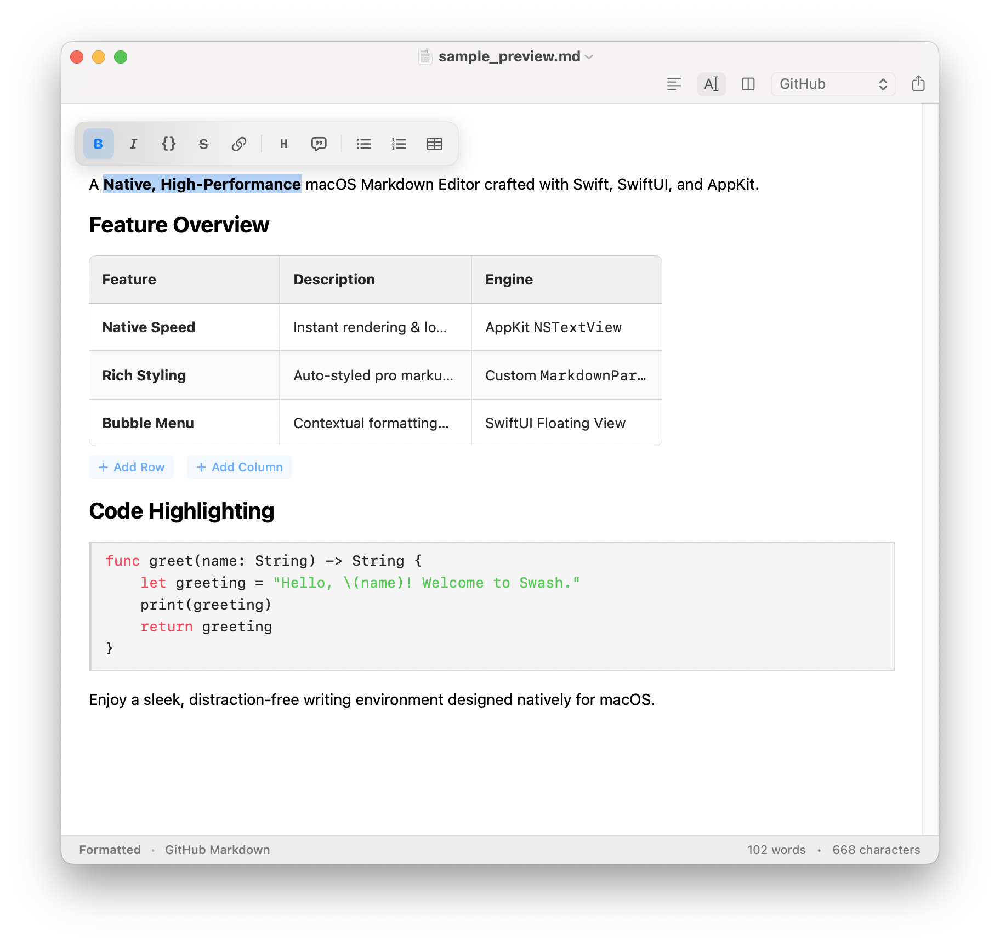

# Swash

A **Native, High-Performance** macOS Markdown Editor crafted with Swift, SwiftUI, and AppKit.

> [!NOTE]
> Swash supports full **GitHub Flavored Markdown (GFM)** with native callout banners, tables, footnotes, and inline images.

Setext Heading Example
======================

## Feature Overview

| Feature | Description | Engine |
| :--- | :--- | :--- |
| **Native Speed** | Instant rendering & low memory | AppKit `NSTextView` |
| **Rich Styling** | Auto-styled pro markup & syntax | Custom `MarkdownParser` |
| **Bubble Menu** | Contextual formatting overlay | SwiftUI Floating View |

> [!TIP]
> Try editing table cells directly in Formatted mode or using shortcut keybindings!

## Code Highlighting

~~~swift
func greet(name: String) -> String {
    let greeting = "Hello, \(name)! Welcome to Swash."
    print(greeting)
    return greeting
}
~~~

## Extended Formatting

- ***Combined Bold & Italic*** with multi-backtick spans like ``func main()``
- Extended autolinks to `www.github.com` and `contact@swash.app`
- Footnotes support[^1] for extra context references

[^1]: Footnotes render automatically in both Formatted mode and Preview pane.

Enjoy a sleek, distraction-free writing environment designed natively for macOS.
